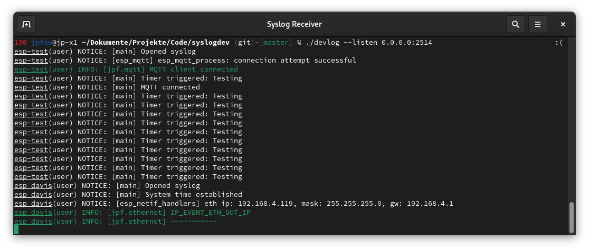

# devlog - simple syslog receiver

This is a very basic tool to receive syslog messages on an UDP port,
format and colorize them and print them to console.

Formatting is currently hardcoded, so if you want to print other fields,
you'll have to change the `logMessage` function in `source/devlog/server.d`.



## Building

This tool is written in [D](https://dlang.org) and like most D applications can be built with dub.

First download and install a compiler (e.g. [DMD](https://dlang.org/download), tested with version 2.094).
Then simply run `dub build` in the root folder of this repository.

Alternatively, you can use the DMD [docker images](https://hub.docker.com/r/dlang2/dmd-ubuntu).

## Usage

If you just run devlog, it will listen on all interfaces on port the standard syslog port 514.
514 is a priviledged port, so you'd have to run devlog with system rights.
Alternatively, you can provide different interfaces and ports to listen on:

```bash
./devlog --listen 0.0.0.0:2514 --listen :::2514
```

The `--listen` argument can be repeated multiple times. Instead of the wildcards presented
above, you can of course also use a concrete interface IP to bind to.
